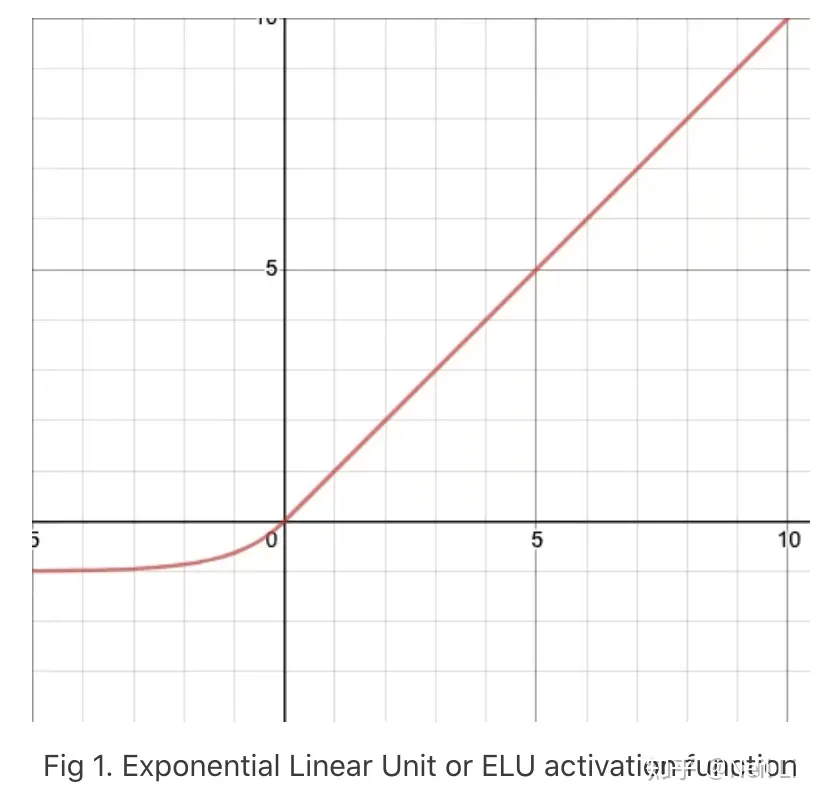
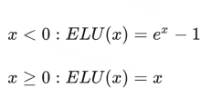
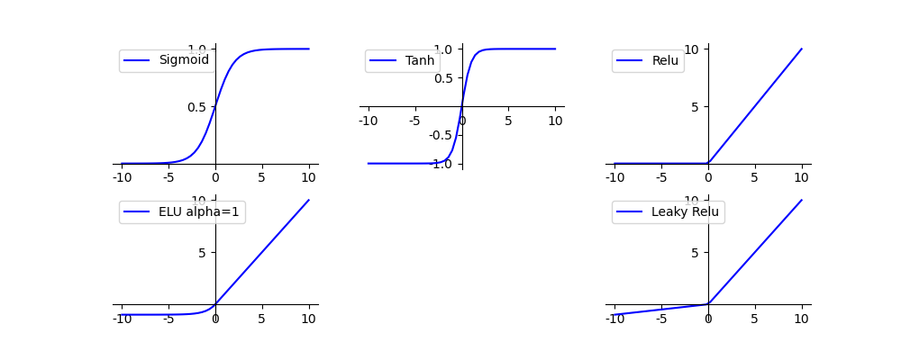
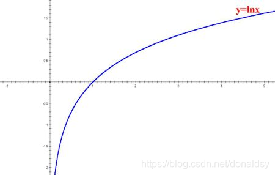
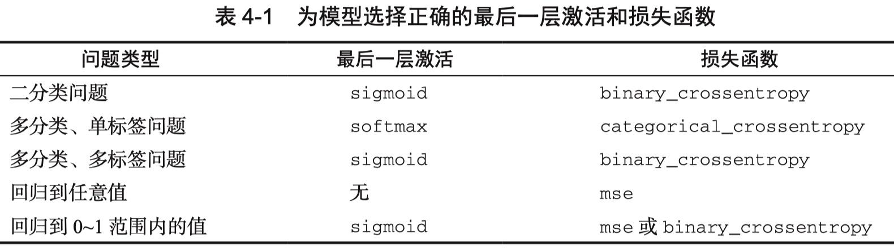
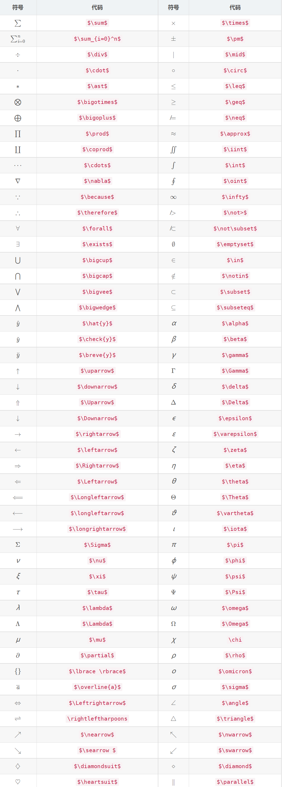

### Elu 激活函数

激活曲线



公式：



```
总结：
与 Leaky-ReLU 和 PReLU 类似，与 ReLU 不同的是，ELU 没有神经元死亡的问题(ReLU Dying 问题是指当出现异常输入时，在反向传播中会产生大的梯度，
这种大的梯度会导致神经元死亡和梯度消失)。 它已被证明优于 ReLU 及其变体，如 Leaky-ReLU(LReLU) 和 Parameterized-ReLU(PReLU)。 
与 ReLU 及其变体相比，使用 ELU 可在神经网络中缩短训练时间并提高准确度。


优点：

它在所有点上都是连续的和可微的。
与其他线性非饱和激活函数（如 ReLU 及其变体）相比，它有着更快的训练时间。
与 ReLU 不同，它没有神经元死亡的问题。 这是因为 ELU 的梯度对于所有负值都是非零的。
作为非饱和激活函数，它不会遇到梯度爆炸或消失的问题。
与其他激活函数（如 ReLU 和变体、Sigmoid 和双曲正切）相比，它实现了更高的准确性。
该函数在负数域存在饱和区域，从而对噪声具有一定的鲁棒性；

缺点：

与 ReLU 及其变体相比，由于负输入涉及非线性，因此计算速度较慢。 然而，在训练期间，ELU 的更快收敛足以弥补这一点。 但是在测试期间，ELU 的性能会比 ReLU 及其变体慢。
```

其他几个激活函数的对比：


[参考链接](https://www.cnblogs.com/Joejwu/p/Joejwu_blog210618.html)

```
data representation：

人的记忆与数据的模式有强烈联系。比如让一位娴熟的棋手记忆某局棋局状态，会显示出超强的记忆力，但如果面对的是一局杂乱无章的棋局，所展现的记忆能力与普通人没什么差别。这体现了模式的力量，可以通过数据间关系进行记忆，效率更高。

autoencoder由于中间层有维度缩减的功效，因而强制它找到一个数据内部的pattern，从而起到高效的对训练数据的记忆作用。
```

### loss函数 损失函数

```
神经网络的学习通过某个指标表示现在的状态，然后以这个指标为基准，寻找最优权重参数，这个指标就是损失函数(loss function)。

神经网络损失函数（loss function）也叫目标函数（objective function）的作用：衡量神经网络的输出与预期值之间的距离，以便控制、调节参数。这个损失函数可以使用任意函数，但一般使用均方误差 和 交叉熵误差。
```

- $y_{k}$ 表示神经网络的输出，即 output
- ${t}_{k}$ 表示监督数据，即label
- $k$ 表示数据维度
- $ \hat{y} $

#### 1. 均方误差

$ E=\frac{1}{2} \underset{k}{\sum} (y_{k}-t_{k})^2 $
代码实现

```python
import numpy as np
def mean_squared_error(y, t):
return 0.5 * np.sum((y-t) ** 2)

# 框架中实现 loss均方误差
reconstruction_loss = tf.reduce_mean(tf.square(outputs - X)) # MSE
```

MNIST手写数字识别程序中中，一张图片的label为2，进行one-hot编码后，可以获得t，其中
t = [0, 0, 1, 0, 0, 0, 0, 0, 0, 0]，
假设该图像经过cnn的输出为y：
y = [0.1, 0.05, 0.6, 0.0, 0.05, 0.1, 0.0, 0.1, 0.0, 0.0]，

使用mean_squared_error(np.array(y), np.array(t)),经过计算，可以获得:loss = 0.09750000000000003。

#### 2. 交叉熵误差

交叉熵损失函数在神经网络中做分类问题时，由于交叉熵涉及到计算每个类别的概率，**所以交叉熵几乎每次都和sigmoid(或softmax)函数一起出现**，用于在神经网络最后一层进行输出每种类别的概率形式。
神经网络最后一层得到每个类别的得分scores（也叫**logits**）；该得分经过sigmoid或softmax函数获得概率输出；模型预测的类别概率输出与真实类别的one hot形式进行交叉熵损失函数的计算。在tensorflow中，交叉熵损失函数主要有以下几种形式：

公式：

$ E= - \underset{k}{\sum} t_{k} log y_{k} $

其中log表示以e为底数的自然对数($ loge^{x} $， 即 lnx)


代码实现：

```python
def cross_entropy_error(y, t):
    delta = 1e-7 
    return -np.sum(t * np.log(y + delta))


# tensorflow中实现

tf.nn.sigmoid_cross_entropy_with_logits(_sentinel=None,labels=None, logits=None, name=None)
```

上面实现代码，加上了一个微小的delta，是因为当出现np.log(0)时，np.log(0)会变为负无穷大，添加一个微小值可以防止负无穷大的发生。

使用「均方误差」中的y、t作为参数，调用 `cross_entropy_error(np.array(y), np.array(t))`，获得结果 0.510825457099338

为了提高训练效率一般都会在每次迭代中使用小批量进行训练，因此计算损失函数时必须将所有的训练数据作为对象。即，如果训练数据有100个，我们就需要将这100个**损失函数的总和作为学习的指标**。

计算公式为： $ E=-\frac{1}{N} \sum_n \sum_k t_{nk} log_{nk} $，**也就是把每一个输出loss进行加总求和**



* 具有多个输出的神经网络可能具有**多个损失函数**（每个输出对应一个损失函数）。但是，梯度下降过程必须基于单个标量损失值。因此，<font color='red'>对于具有多个损失函数的网络，需要将所有损失函数取平均，变为一个标量值。</font>

```python
# tensorflow中实现
# 作用：计算labels和logits之间的交叉熵。其中，logits表示经过神经网络输出计算得到的未归一化的概率，之后logits会先通过softmax运算再计算交叉熵
tf.nn.softmax_cross_entropy_with_logits()

# 对输入进行sigmoid 函数运算之后，再计算交叉熵。
tf.nn.sigmoid_cross_entropy_with_logits()

# 是计算具有权重的sigmoid交叉熵函数，其中pos_weight表示加在正样本上的一个系数。
weighted_cross_entropy_with_logits(targets, logits, pos_weight, name=None):

# 它们都是用于计算二分类任务的交叉熵损失。BinaryCrossentropy是一个类，需要先定义再调用，返回的是一个最终loss。而binary_crossentropy是一个函数，计算每个位置的损失值，返回的结果与batch_size大小一样，需要再通过reduce_mean()计算最终loss
keras.losses.binary_crossentropy(y_true, y_pred, from_logits=False, label_smoothing=0)

# 示例
y_pred = np.array([[0.5, 0.1], [0.3, 0.8]])
y_true = np.array([[1, 0], [0, 1]])
loss = tf.losses.BinaryCrossentropy()
print(loss(y_pred=y_pre, y_true=y_true))

# 输出： tf.Tensor(0.3445814251899719, shape=(), dtype=float64)

# categorical_crossentropy()和CategoricalCrossentropy()是用计算多分类任务的交叉熵
def categorical_crossentropy(y_true,
                             y_pred,
                             from_logits=False,
                             label_smoothing=0)

# 示例
 y_true = [[0, 1, 0], [0, 0, 1]]
 y_pred = [[0.05, 0.95, 0], [0.1, 0.8, 0.1]]
 loss = tf.keras.losses.categorical_crossentropy(y_true, y_pred)
 print(loss.numpy())
 
 array([0.0513, 2.303], dtype=float32)
```

[tensorflow中交叉熵实现参考链接](https://blog.csdn.net/FrankieHello/article/details/118188350)

[参考链接:# 常见损失函数 & 损失函数选择方法](https://blog.csdn.net/donaldsy/article/details/101295422)

`公式使用LaTex表示` [LaTeX表示参考](https://www.cnblogs.com/nowgood/p/Latexstart.html)
[LaTeX表示参考2](https://blog.csdn.net/qq_46092061/article/details/121862287)


加^号 ：      $\hat{x}$
加横线 ：    $\overline{x}$
加宽^：       $\widehat{x}$
加波浪线 ： $\widetilde{x}$
加一个点 ： $\dot{x}$
加两个点：  $\ddot{x}$

花体 \mathcal
$\mathcal L$: 常用来表示损失函数
$\mathcal D$: 常用来表示样本集
$\mathcal N$: 常用来表示高斯分布
空心 \mathbb
$\mathbb R$: 常用来表示张量
$\complement_AB$ :表示绝对补集


### 优化器

