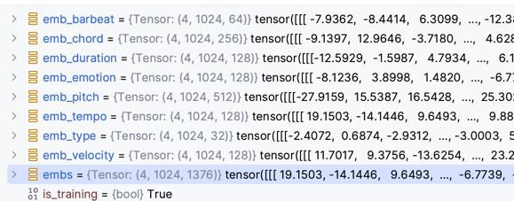

## transformers 有什么用?

三种mask。各类mask的作用

1. Encoder的padding mask     换成等长的词向量
2. masked multi-head attention 序列因果mask，causal mask 就是防止看到后面内容的一种mask
3. encoder memory和decoder交叉注意力 mask和encoder类似，涉及两个不同序列，长度可能不同。

### 总结

1. 单词索引构成的句子，构建patch，带padding。
2. 构造word embedding     ✅  两句话，单句最长4个词 shape=(2,4)  词嵌入后（词改为高维向量）  shape=(2,4,6)
3. 构造position embedding   ✅   两句话，单句最长4个词 shape=(2,4) 位置嵌入(每个词的位置同样使用高维向量表示)后  shape=(2,4,6)
4. Encoder 的self-attention  padding mask  ✅明白了，构建**邻接矩阵**，(2,4)-> (2,4,4); 词两两比较，如果是padding就表示mask=Ture，再把score改为e-10极小   **就是为了把padding到的权重改为极小，这样反向传播影响就会变小**

### 1. Word embedding

代码中model_dim 的意思，是把每个词映射到一个多维空间中，这个空间的维度是多少。
比如m_dim=512，那么每个词就是一个512维的向量。
举一个场景：假如有8个词，有两个句子，我们为了更好计算，会把每个句子都设置成相同长度，所以会求最大的句子长度。
每个句子的单词量如果达不到最大句子长度，就用padding的方式，用0补全。
比如最长句子有4，有两个句子，一个是2个词，一个4个词。都会补全成4个词。这样就得到一个(2,4)的矩阵。
然后把每个词映射到高位空间后，加入每个词用dim=6维向量表示词嵌入，原来(2,4)的矩阵，就变成了(2,4,6)的矩阵。即每个词都从1个索引变成了6长度的向量。。

这里的8个词加一个0，就是9个6维的特征向量。类似词表vocab_size=9，每个词都是6维的向量。

其他文章中：特征序列的 shape 由原来的 [2, 4] 变成 [2, 4, 6]，即特征序列中有 2 个句子，每个句子包含 4 个单词，每个单词用长度为 6 的向量来表示。

所以这个的动作就是把句子中每个词映射到高维空间中。每个句子是一个对应维度的多维变量。

```python
# num_embeddings (int): size of the dictionary of embeddings
# embedding_dim (int): the size of each embedding vector
# 实例化embedding类, 一共8种单词，考虑到padding填充的0，因此单词表一共9种, 每种单词的特征向量长度为6
src_embedding_tabel = nn.Embedding(num_embeddings=max_word_idx+1, embedding_dim=model_dim)  # 特征序列的Embedding
tgt_embedding_tabel = nn.Embedding(num_embeddings=max_word_idx+1, embedding_dim=model_dim)  # 目标序列的Embedding
```

```
# src_embedding_tabel.weight
Parameter containing:
tensor([[-1.1004, -1.4062,  1.1152,  0.9054,  1.0759,  1.1679],
        [-0.0360, -1.6144,  0.9804,  0.4482,  1.8510,  0.3860],
        [ 0.2041,  0.1746,  0.4676, -1.3600,  0.3034,  1.7780],
        [ 0.5122, -1.3473, -0.2934, -0.7200,  1.9156, -1.5741],
        [ 0.7404, -1.1773,  1.3077, -0.7012,  1.9886, -1.3895],
        [-1.8221, -0.7920,  0.9091,  0.4478, -0.3373, -1.5661],
        [-0.9194,  0.3338,  0.7215, -1.2306,  0.9512, -0.1863],
        [-1.3199, -1.4841,  1.0171,  0.8665,  0.3624,  0.4318],
        [-1.7603, -0.5641,  0.3106, -2.7896,  1.6406,  1.9038]],
       requires_grad=True)
 
# src_embedding
Embedding(9, 6)
tensor([[[-0.9194,  0.3338,  0.7215, -1.2306,  0.9512, -0.1863],
         [ 0.7404, -1.1773,  1.3077, -0.7012,  1.9886, -1.3895],
         [-1.1004, -1.4062,  1.1152,  0.9054,  1.0759,  1.1679],
         [-1.1004, -1.4062,  1.1152,  0.9054,  1.0759,  1.1679]],
 
        [[-0.9194,  0.3338,  0.7215, -1.2306,  0.9512, -0.1863],
         [ 0.7404, -1.1773,  1.3077, -0.7012,  1.9886, -1.3895],
         [-0.0360, -1.6144,  0.9804,  0.4482,  1.8510,  0.3860],
         [-1.3199, -1.4841,  1.0171,  0.8665,  0.3624,  0.4318]]],
       grad_fn=<EmbeddingBackward>)
```

### 2. Position embedding

**注意力机制更多的是关注词与词之间的重要程度，而不关心句子中词语位置的顺序关系。**

例如：“从北京开往济南的列车”与“从济南开往北京的列车”，词向量表示并不能对两句话中的“北京”进行区分，其编码是一样的。但是在真实语境中，两个词语所表达的语义并不相同，第一个表示的是起始站，另一个表示的是终点站，两个词所表达的语义信息并不相同

**因此以 Attention 结构为主的大规模模型都需要位置编码来辅助学习顺序信息**

<font color='red'>**Transformer 模型通过对输入向量额外添加位置编码来解决这个问题**</font>。**Transformer 模型中采用正弦位置编码**。**利用正弦和余弦函数来生成位置编码信息，<font color='red'>将位置编码信息与词嵌入的值相加，作为输入送到下一层。</font>**

`所以也可以把其他信息编码信息与词嵌入的值相加，作为输入传入到下一层。比如情绪标签，音高，音长，强度等`

PE(pos,i)代表对应pos行第i列的词的Position Enbedding向量表示；
pos代表行，i代表列，$d_model$ 代表位置索引的向量长度

奇数列位置： $PE(pos, 2i)=sin(\frac{pos}{10000^{\frac{2i}{d_{model}}}})$
偶数列位置： $PE(pos, 2i+1)=cos(\frac{pos}{10000^{\frac{2i}{d_{model}}}})$

position embedding 也会把每个词的位置信息用一个dim维向量来标识。
比如dim=6，上面的场景2句话，每句话最长4个词，每个词的位置嵌入同样用dim=6维向量表示，经过公式计算后，实例化一个embedding层dim=6，这样最终shape=(2,4)的位置嵌入也变成了shape=(2,4,6)

**首先初始化一个 4 行 6 列的矩阵，其中行代表位置索引，列代表每个位置用多少长的向量来表示。**根据公式，奇数列用 cos 函数代替，偶数列用 sin 函数代替。得到正余弦编码后的张量。接下来实例化 **nn.Embedding()**，将**随机初始化的 embedding 层的权重矩阵换成正余弦位置编码后的权重**，并且在**训练过程中不更新位置权重**。如下面第一个矩阵所示。

然后构造特征序列中句子的每个单词的位置索引 **src_pos**，每个句子包含 4个单词，因此单词位置索引就是 [0,1,2,3]，其中 **src_pos.shape = [2, 4]** 代表特征序列有 2 个句子，每个句子有 4 个单词位置索引。经过 Position Embedding 层之后，shape 变成** [2, 4, 6]**，代表特征序列中有 2 个句子，每个句子包含 4 个单词位置，每个单词位置由长度为 6 的特征向量来表示。如下面第二个矩阵所示。

```python
# 实例化embedding层，对每句话中的4个单词使用长度为6的向量来编码

pe_embedding = nn.Embedding(num_embeddings=max(src_len), embedding_dim=model_dim)
```

```
# pe_embedding.weight (正余弦位置编码)
tensor([[ 0.0000,  1.0000,  0.0000,  1.0000,  0.0000,  1.0000],
        [ 0.8415,  0.5403,  0.0464,  0.9989,  0.0022,  1.0000],
        [ 0.9093, -0.4161,  0.0927,  0.9957,  0.0043,  1.0000],
        [ 0.1411, -0.9900,  0.1388,  0.9903,  0.0065,  1.0000]])
 
 
# src_pe_embedding
tensor([[[ 0.0000,  1.0000,  0.0000,  1.0000,  0.0000,  1.0000],
         [ 0.8415,  0.5403,  0.0464,  0.9989,  0.0022,  1.0000],
         [ 0.9093, -0.4161,  0.0927,  0.9957,  0.0043,  1.0000],
         [ 0.1411, -0.9900,  0.1388,  0.9903,  0.0065,  1.0000]],
 
        [[ 0.0000,  1.0000,  0.0000,  1.0000,  0.0000,  1.0000],
         [ 0.8415,  0.5403,  0.0464,  0.9989,  0.0022,  1.0000],
         [ 0.9093, -0.4161,  0.0927,  0.9957,  0.0043,  1.0000],
         [ 0.1411, -0.9900,  0.1388,  0.9903,  0.0065,  1.0000]]])
```

### 3. **self\_attention\_Mask**

**这里介绍 Encoder 中 Muti\_head\_attention 中的 mask 方法**

由于每个特征句子的长度不同，经过 padding 之后每个句子的长度一致。在特征序列中，第一个句子只包含 2 个单词，用 1 来表示，后两个填充的位置用 0 值来表示。因此将特征序列表示为 [[1, 1, 0, 0], [1, 1, 1, 1]]，其 shape=[2, 4]

接下来<font color='red'>**构建邻接矩阵 shape=[2, 4, 4]**</font>，其中有 4 行和 4 列的单词，**邻接矩阵中每个元素代表两两单词之间的对应关系****，若为 1 则代表有效单词，若为 0 则代表无效单词，是通过 padding 得到的。**

接下来只要**将邻接矩阵中所有元素为 0 的区域都打上掩码，<font color='red'>**将该位置的元素值变得非常小**</font>。

下面的第一个矩阵是经过 padding 后的特征序列的邻接矩阵；第二个矩阵是随机生成的输入序列；第三个矩阵是经过掩码后的序列，将 mask 的元素值变得非常小，<font color='red'>**这样在计算交叉熵损失时，经过 softmax 函数后这些做过 padding 的元素变得非常小，在反向传播过程中对模型的整体影响较小。**</font>

```
# 邻接矩阵，0代表是是经过padding后的区域
tensor([[[1., 1., 0., 0.],
         [1., 1., 0., 0.],
         [0., 0., 0., 0.],
         [0., 0., 0., 0.]],
 
        [[1., 1., 1., 1.],
         [1., 1., 1., 1.],
         [1., 1., 1., 1.],
         [1., 1., 1., 1.]]])
 
# 随机构造的输入特征score, shape=[2,4,4]
tensor([[[-0.1509, -0.2514, -0.5393,  2.0241],
         [-0.1525, -1.9199,  0.6847, -1.8795],
         [ 1.0322,  0.0772,  0.9992, -0.1082],
         [ 1.4347,  1.4084, -0.6897, -0.2518]],
 
        [[-0.0109,  0.0328,  1.5458,  0.9872],
         [ 0.0314, -1.3659, -0.6441, -1.6444],
         [-0.0487,  0.0438,  0.0576, -1.1691],
         [ 0.3475, -0.1329, -1.0455, -0.9671]]])
 
# 打上 mask 之后的 score
tensor([[[-1.5094e-01, -2.5137e-01, -1.0000e+10, -1.0000e+10],
         [-1.5255e-01, -1.9199e+00, -1.0000e+10, -1.0000e+10],
         [-1.0000e+10, -1.0000e+10, -1.0000e+10, -1.0000e+10],
         [-1.0000e+10, -1.0000e+10, -1.0000e+10, -1.0000e+10]],
 
        [[-1.0883e-02,  3.2843e-02,  1.5458e+00,  9.8725e-01],
         [ 3.1395e-02, -1.3659e+00, -6.4410e-01, -1.6444e+00],
         [-4.8689e-02,  4.3825e-02,  5.7644e-02, -1.1691e+00],
         [ 3.4751e-01, -1.3290e-01, -1.0455e+00, -9.6713e-01]]])
```

[Transformer 中的 Encoder 机制，参考](https://blog.csdn.net/dgvv4/article/details/125507206)

---

## Emopia的原生代码解析

nclass = [56, 135, 18, 4, 87, 18, 42, 5]


emopia中的训练阶段。
把每个类型都embedding一下，最后concat在一起，当成input进行训练，训练数据长度是1024
target就是下一帧(n+1)的1024。

input经过一个embedding+concat，
再一个全连接成一个固定尺寸，再追加一个position embedding，这个作为encoder的输入。
再经过transformer的encoder（带attn mask的）之后，输出预测的target

再用全连接投射了一个type出来。

这有一个疑问，所有的embedding之后concat在一起了，再用全连接投射，这有啥用呢？  参考了GoogleT5网络找到了原论文，在emopia demo readme中。


参考黑盒解析transformer[Pytorch中 nn.Transformer的使用详解与Transformer的黑盒讲解](https://github.com/iioSnail/chaotic-transformer-tutorials/blob/master/nn.Transformer_demo.ipynb)

