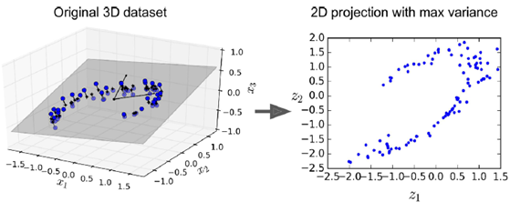
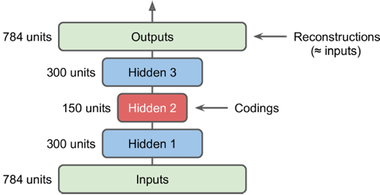
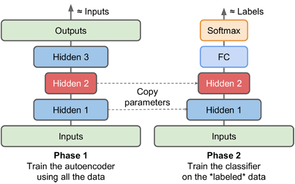
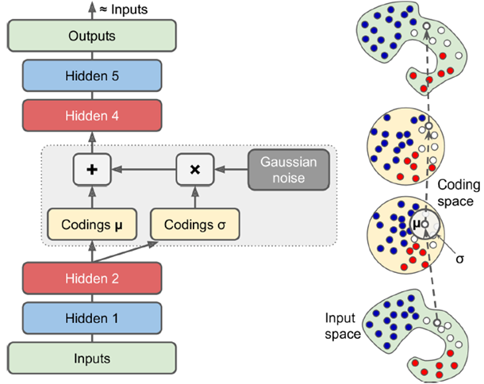
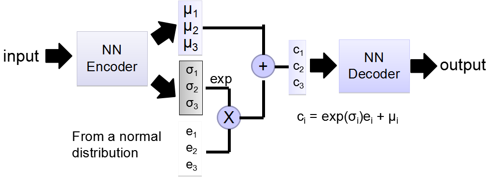

##### data representation：

人的记忆与数据的模式有强烈联系。比如让一位娴熟的棋手记忆某局棋局状态，会显示出超强的记忆力，但如果面对的是一局杂乱无章的棋局，所展现的记忆能力与普通人没什么差别。这体现了模式的力量，可以通过数据间关系进行记忆，效率更高。

autoencoder由于中间层有维度缩减的功效，因而强制它找到一个数据内部的pattern，从而起到高效的对训练数据的记忆作用。

中间隐层作用如下图所示，将左图中3维的图形选取一个最优截面，映射到二维平面上。

做多个隐层，并且输入到输出形成一个对称的关系，如下图所示，从输入到中间是encode，从中间到输出是一个decode的过程。

常见的训练手段是逐层训练，隐层1训练出后固定权值，训练hidden2，再对称一下（hidden3与hidden1完全对应），得到最终训练结果

#### Pretraining

若大量数据无label，少量数据有label，则用大量无label数据在第一阶段作无监督的Pretraining训练，将encoder部分直接取出，output部分做一个直接改造。减少由于有label数据过少导致的过拟合问题。

这儿可以在我的场景里用吗？用一个无标注大量的数据集学习音乐基础知识，再用emopia带情绪标注的数据集进行训练，这样能提高训练效果吗？

让音乐更像人创造的音乐？

工作量啊工作量。

#### Variational Autoencoder

使用时把encoder去掉，随机加入一个高斯噪声，在输出端可以得到一个完全新的输出

即input通过NN Encoder之后生成两个coding，其中一个经某种处理后与一个高斯噪声（即一系列服从正态分布的噪声）相乘，和另一个coding相加作为初始的中间coding。下图与上图同理，最终生成的output要最小化重构损失
即：$\sum_{i=1..3}[exp(\sigma_{i})-(1+\sigma_i)+(\mu_i)^2]$越接近0越好

参考  [无监督学习Autoencoder和VAE](https://www.cnblogs.com/rucwxb/p/8056144.html)  深入理解下VAE

